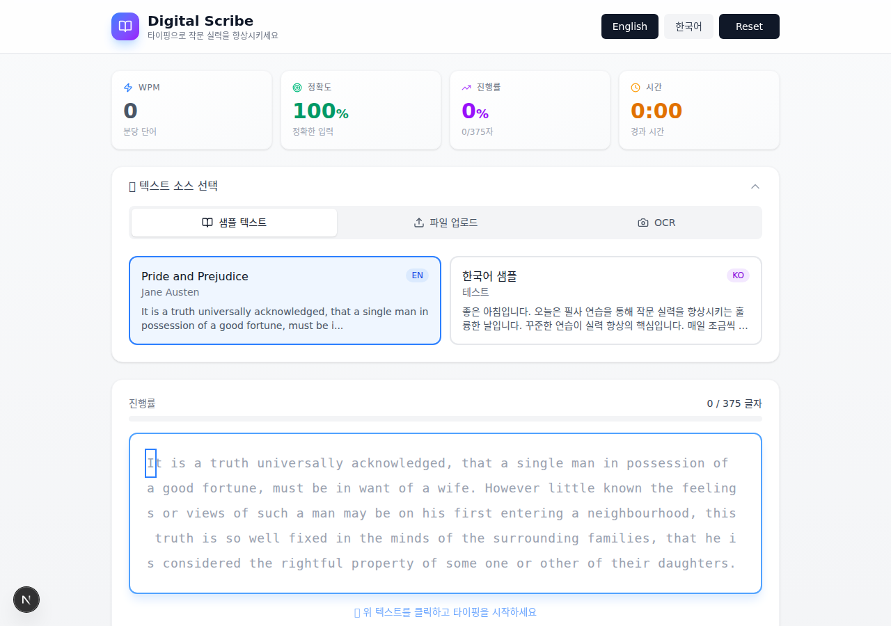

# Digital Scribe

Multilingual transcription platform to enhance authoring skills and typing speed using curated news, editorials, and novels.

## Screenshot



## Features

- Multilingual support (English, Korean)
- Real-time typing practice with accuracy tracking
- Performance metrics (WPM, accuracy, progress)
- Character-by-character feedback
- File upload support (txt, md, xlsx, csv)
- OCR support for book pages
- Easy text reset functionality

## Getting Started

```bash
# Install dependencies
npm install

# Run development server
npm run dev
```

Open [http://localhost:3000](http://localhost:3000) with your browser to see the result.

## Tech Stack

- **Framework**: Next.js 16
- **Language**: TypeScript
- **Styling**: Tailwind CSS
- **State Management**: Zustand

## License

MIT
